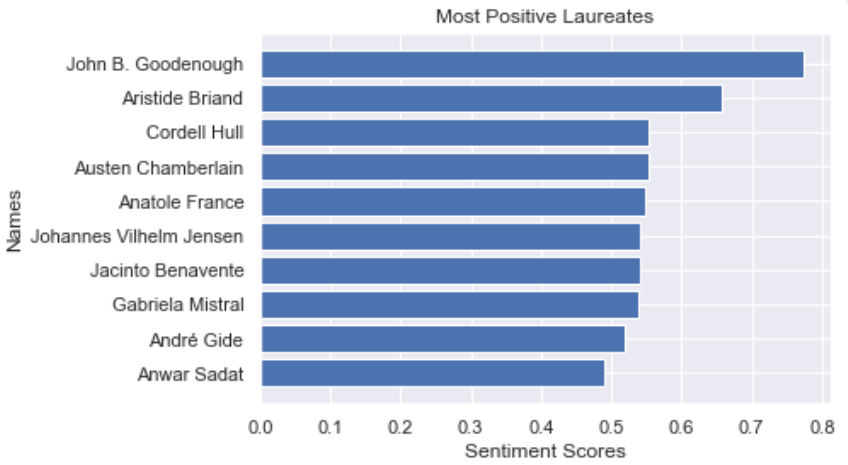
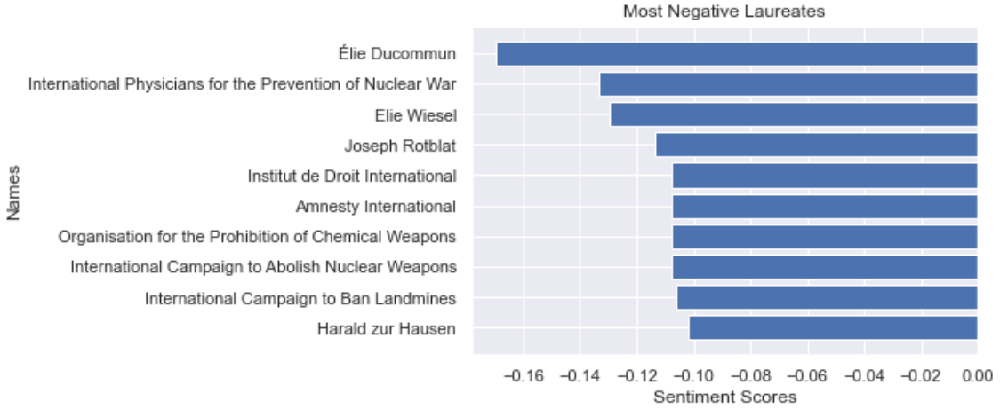
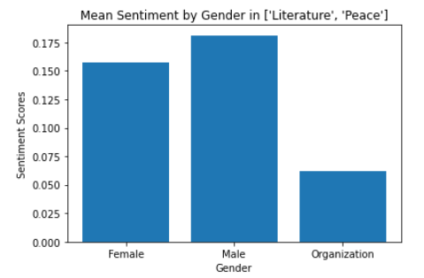

# SENTIMENT

Something very interesting that can be combined with a network analysis, is the sentiment analysis of the nodes. We of course did that in our project too. In order to extract sentiment for the Nobel Laureates (nodes), we need a text that is related with them, that contains some sentiment. As the WikiPages that we used previously, are sentiment-neutrally created, we could not use them for sentiment analysis. 

But what kind of text could possibly contain some sentiment for the Laureates?

Yes you guessed correctly! The answer is their Nobel Prize Lectures. The Nobel Lectures, are the Lectures the Laureates give before or after receiving their prize. It is a text, that all (or most) Laureates have created, and also contain some sentiment. So this seems like a very good source of sentiment for our project.

The Nobel Lectures though do not exist in an opensource library that we can just download. So we had to create a webcrawler, using the *selenium* library in python and crawl through the different pages of the official website for Nobel Prizes (nobelprize.org). This website, contains the information we need in most cases, but the format between different webpages differ a lot, so we found much information but not for all the Laureates.

As now we have a dataset, that we can extract sentiment, we now need to find a tool to do that. Thankfully, there is a very good and sophisticated library called VADER for this job. Th VADER lexicon calculates the sentiment of whole sentences and contains evaluations for symbols and emojis, so its results are better than other methods in many cases. The scores created by the VADER methods, lie in the interval [-1,1], with -1 indicating very negative sentiment, 1 indicating very positive sentiment, while 0 accounts for neutral sentiment.

Now, let's see some results!

First of all let's see the histogram of the sentiment between Nobel Prize Laureates.

As we can see from the figure above the sentiments of the Laureates are concentrated around the value $0.1$. This means that the texts of their Nobel lectures are not much emotional, but are at least positive in most cases.

We can also find  who have the most positively, or negatively emotional Lectures among the laureates. The results for this experiment are depicted in the figures below.

 

As we can see, the most negative emotiolanlly Lectures, were given by organizations that received the Peace award, and not individuals. This pattern is very interesting, and we wonder why is that happening. The answer may be that these Organizations fight against something negative happening in the globe, and this is what they talk about in their lecture. 
Something that also needs to be commented is themost positive Laureate *John B. Goodenough*, even though he is a chemist, and his lecture was mostly about figures and mathematical formulas, he holds the most positive score. This is because he refers to technologies that are going to have very positive results to the world.
Also, the most negative sentimented Laureate, is a *Élie Ducommun*, even though he won the nobel Peace Prize, in his Lecture, he is talking about "The Futility of War Demonstrated by History", and that is the reason of the very negative score. 

Consecutively we created the bar plot of the average sentiment per year for the different categories. The category that is mostly interesting totalk about is the sentiment of Laureates awarded the Literature Nobel Prize. In the figure below we can see why.

As we observe above, the sentiment in Literature Lectures between 1901 and 2020, changes between periods. We can see that there is a clear reduction of sentiment as the years passed. We can also distinct three periods in that plot. From 1901-1940, the sentiment started rising and reached a peak around 1920 and remained relatively high the consecutive years. Then from 1940-1980, the scores started declining fast and reached the first negative scores. Finally, from 1980-2019 the sentiment started growing in the beginning but, declining again at the second half. We can somehow distinct different generations (or eras) by observing this plot.

Last but not least, after looking at the results above about the negative sentiments among Organization Lectures, we decided to find also how the sentiment is distributed between the genders. 

The figure above is a bar plot, that shows us an interesting result. We are presenting the mean score of sentiment in Peace and Literature categories, by gender. Even though some research [link](https://www.researchgate.net/publication/321405914_Gender_Bias_in_Sentiment_Analysis) shows that there is a bias in sentiment scores, and females tend to have higher sentiment scores, our plot show that this is not the case in our experiment.
