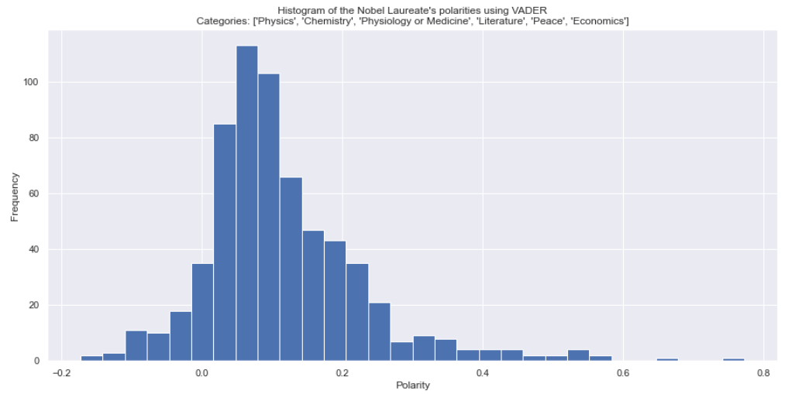
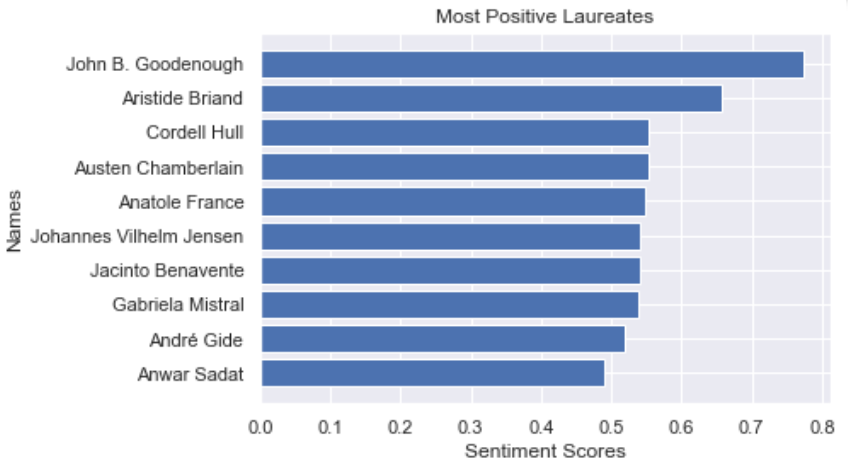
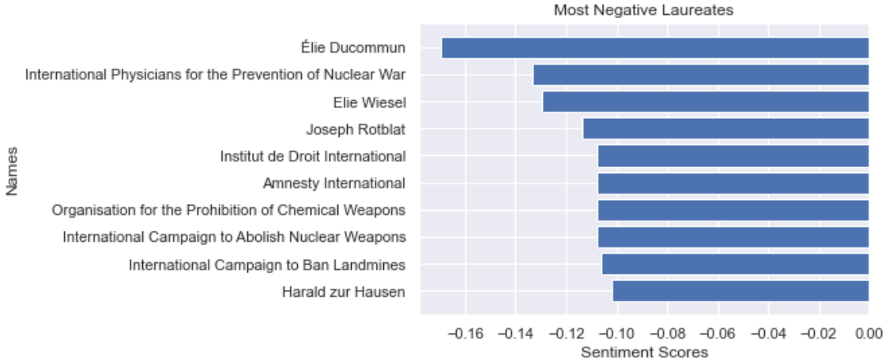
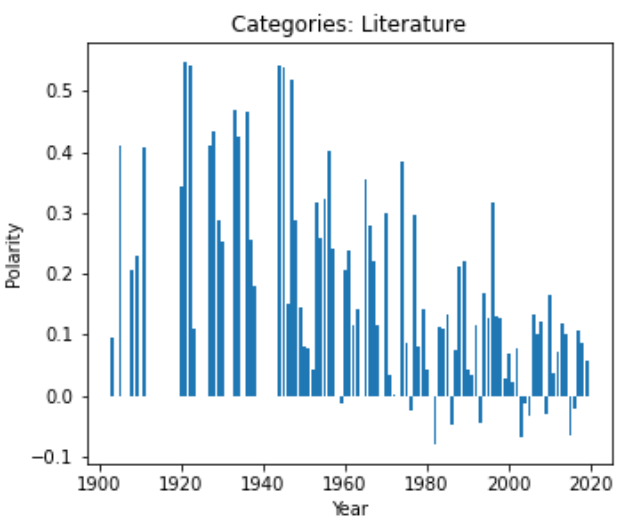
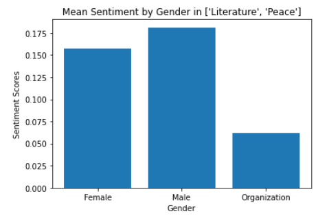

%---
%layout: page
%---

%

%# The network of Nobel Prize Laureates 

## Introduction

We chose to build the network of Nobel Prize Laureates, using a list of Nobel laureates found on [Wikipedia](https://en.wikipedia.org/wiki/List_of_Nobel_laureates#List_of_laureates), in which there is an edge between two laureates if one of the laureate's Wikipedia page contains a link to the other laureate's page. The network consists in 969 nodes and 3220 edges. We decide to add the attributes year, prize, age, country of birth and gender, retrieved from the laureates' Wikipedia pages, to the nodes of the network. 

Through our analysis of the network, we would like to better understand Nobel Prize laureates and the prizes themselves. In particular, we would like to know what characterizes Nobel laureates in terms of age, gender and nationality, how they are connected to each other and what are the communities of laureates. Finally, we will analyze the Nobel lectures of the laureates, that we extracted from nobelprize.org, to understand their sentiments and how they evolve through time. 

## Network visualization

Below, we visualize the network, where laureates are represented by nodes whose size is proportional to their degree and which are colored according their prize, and edges are colored in red if they connect laureates that were awarded different prizes. 

  

Prizes seem to form clusters. But whereas Economics, Peace and Literature form three distinguishable clusters, the scientific prizes, Physics, Chemistry and Physiology or Medicine, seem to form one big cluster. Indeed, these three scientific fields are interdependent, so their clusters are highly interconnected. In addition, the Economics, Peace and Literature clusters seem quite interconnected and well separated from the science cluster, with Peace lying between Literature and Economics which is a little farther. Nevertheless, there is still a significant amount of links that connect these three prizes to the science cluster, revealing the interdependency of the fields. 

Moreover, four bigger nodes stand out: the biggest node of the network, which is Albert Einstein in Physics, followed by the European Union in Peace, and two black nodes, Linus Pauling and Marie Curie, in the science cluster.

You can explore yourself the network with the interactive visualization below and look at the different laureates and their attributes. 

<iframe src="images/bokeh.html"
    sandbox="allow-same-origin allow-scripts"
    width="100%"
    height="800"
    scrolling="no"
    seamless="seamless"
    frameborder="0"> </iframe>
    
## Statistics

To know more about the network of laureates, we will compute basic statistics about the number of laureates in each prize, the age of laureates, their gender, country of birth and connectivity. The most interesting results have been summarized below, and more statistics can be found in the explainer notebook which you can find in the GitHub repository of the webpage.

### Number of Laureates in each Nobel Prize

Before studying the attributes of Laureates, let's look at how they are distributed in the different Nobel prizes.

  

The scientific prizes have the most Laureates because it is common that they are jointly awarded to several Laureates at the same time, whereas the Literature Nobel Prize usually awards only one Laureate every year. It shows that science relies on the multiple perspectives of different researchers on the same topic, unlike Literature which is more centered on the individual perspective of a single writer.

  

According to this plot, the total number of laureates has increased with the years, due to the increase in laureates in almost all of the prizes (except Litterature, with one laureate almost every year) and the introduction of the Economics Nobel Prize in 1969, until 2000 when it begins to stabilize. In addition, we can see two noticeable holes in the plot at the time of the two world wars.

Moreover, this plot explains the distribution of laureates in the different prizes, as seen in the previous figure. Indeed, according to the bar plot, the Peace Nobel Prize is usually awarded to one or two laureates every year, that's why it has an intermediate position in the previous figure. In addition, the Economics Nobel Prize has been introduced later than the other prizes, so it has fewer laureates.

### Age 

Let's find out at what age you can expect to be awarded a Nobel Prize. 

  

The age to receive a Nobel Prize seems normally distributed around 60, with a mimimum of 17 and a maximum of 97. Let's look at how it differs according to the prize.

All the prizes seem to have roughly a normal distribution for age, with a mean around 60 and maximum around 90. However, the Peace Nobel Prize begins to be awarded earlier in life, with a minimum age of 17, contrary to the Literature and Economics Nobel prizes, which begin to be awarded much later in life, at 42 and 47 respectively. This can be explained by the fact that a writer or an economist, or any scientist, has to build a sufficient amount of work to be recognized, while activists can quickly impact society, with the example of Malala which was awarded the Nobel Prize at the age of 17.

### Gender

Nobel Prizes are awarded to individuals but also organizations, in the case of the Peace Nobel Prize. By looking at the gender of individual laureates, we will be able to assess the Nobel Prize gender gap. 

  

Females account for less than 10% of all the individual laureates. 
But in which prizes are they distributed? Are there more feminine Nobel prizes?

  

According to this plot, 30% of all female laureates were awarded the Peace Nobel Prize, followed closely by Literature with more than 25% and Medicine with 20%.

Finally, we would like to know if the Nobel Prize gender gap has been reduced over time.

  

This figure suggests that the Nobel Prize gender gap is reducing in recent years. Indeed, according to the plot, the frequency and yearly number of female laureates has increased since 1960-1970 and reaches a significant proportion of all individual laureates since 2000. But has it improved in all Nobel prizes, including the most masculine field, Physics?

  

There is indeed a recent increase in the frequency and number of female laureates in all Nobel prizes. But this increase is unequal according to the prize. In particular, Physics and Economics Nobel Prizes are still not much awarded to female laureates even nowadays.

### Country of birth

Are there countries from which most of the laureates come from?

  

The Unites States clearly has by far the most laureates: by counting only the laureates whose country attribute is not 'Unknown', more than 25% of all laureates were born in the United States. Many of the laureates were also born in Germany and France, with respectively more than 10% and 5% of all laureates. More surprising is the fact that Austria, Russia and Poland are in the top 10 countries even though today they are not considered among the most advanced countries in the world, but this could be explained by their past contribution to science. On the contrary, China, which is today one of the most powerful countries in the world, and competes wih the United States on the international stage, is not in the top 10 countries, because it is still an emergent country. To confirm these hypotheses, we investigated the evolution of the number of laureates from these 4 countries.

  

Laureates from Austria, Russia and Poland were indeed mostly awarded in the past. According to the plots, laureates from Austria and Poland frequently received Nobel Prizes in the past but the frequency seems to decrease with time, especially for Poland. On the other hand, Russia had a high frequency of Nobel Prizes during the Cold War. On the contrary, Nobel Prizes were not much awarded to Chinese laureates in the past, but it has become more frequent since 1990, which makes sense given that China is an emergent country.

Finally, we would like to know if the top countries are the same for all Nobel Prizes, and if any country is especially strong in one field.

  

According to the plots, the United States is the first country for all Nobel Prizes. It is especially good in Economics, for which almost 50% of the laureates come from the United States, but less in Literature, for which France has almost the same number of laureates (10%). Germany follows the United States in all scientific prizes, but is outcompeted by France for Peace.

## Connectivity
In this section we would like to show how connected our network is. As part of measuring the network's connectivity, we have created three different plots, each representing a different piece of information about the network.

### Most Influential Laureates
First, let's take a look at who are the most influential laureates in our network. In order to accomplish this, we plotted the top 10 laureates with the highest degree in the network.

  

As it can be seen in the plot, almost all of the laureates shown in the plot, have won the award in one of the scientific categories. "United Nations" is also on the top ten list which is most likely because many laureates in the peace category are somehow related to this organization due to their activities, thus the number of connectios of this node is relatively high. Additionally, an organization such as United Nations could potentially have links to laureates in other categories as well.

### Connectivity Through Time
The goal of this part is to discuss the connectivity of the network for each year. The following plots are provided in this regard.

The first plot below represents the average degree for each year. Based on the plot, it's clear that four periods of time have the highest average degrees. In the first period, the prize was only awarded in two categories, Physics and Chemistry, which clarifies the noticable high average degree in the year 1918. Additionally, The laureates in these categories were "Max Planck" and "Fritz Haber" who are both located in our network with a great amount of connectivity. The other three periods were 1962, 1954 and 1944. In each of these years, there was a laureate who is also listed among our top 10 most influential laureates with the highest degree, people like "Otto Hahn", "Linus Pauling" and "Max Born". Therefore, the average degree in the mentioned years is almost higher than the other years.

  

Using the second plot, we attempted to represent the maximum degree over time. There is a noticeable difference in the maximum degree for each year before 1965 compared to years after 1965. The reason behind this might be that as we move forward in time, references (links) to laureates who won the award in the past increase. This may caused by the citations or references made by recent laureates to previous laureates work. consequently, the average degree in the years before 1965 is higher than in recent years.

  

### Connectivity for Each Category
We can also examine connectivity from another aspect by investigating the maximum degree of connection among the winners of each category.
According to the following plot, clearly, the Physics category is the one with the highest connectivity.Why is this so?
This can be explained by the fact that laureates in the Physics category tend to have more collaboration in their research fields and other scientific areas, also it may be possible that they have shared the prize with one or to other laureates. As well as that, It is possible to consider references and citations in this regard. On the other hand, the lowest maximum degree belongs to the literature category. Perhaps this is because literature laureates may not collaborate as much as other categories. Moreover, there is no significant relation between laureates in literarture and laureates in other categories.

  

## Word Clouds
What words appeared the most in laureates pages?
How does the word or words relate to the category in which the laureate was awarded?
In this section we used word clouds to show the most frequent words in each of the prize categories as well as in each community (which we obtained by implementing [Louvain Method](https://en.wikipedia.org/wiki/Louvain_method)).

### Category Word Cloud
Below you can find the word clouds for each category.

  

As it can be seen in the picture, words like "Particle", "Neutrino", "Gravitational", "Supernova" and etc. have appeared the most in the Physics category. This represents, most of the content of laureates Wikipedia pages is about the main concepts of physics like gravity, subatomic particles, astronomy and etc. It is interesting to note that the word "Protein" appeared in both Chemistry and Physiology or Medicine categories. As was expected, there is a lot of economy-related phrases shown in the Economics category word cloud. Words like "poem", "poetry", "screenplay" and "playwright" are the most frequent ones in the Literature category which refer to different contexts of literature. Most of the words appeard in the word cloud of Peace category are abberivations for peace related or political organizations.

### Communities Word Cloud
According to the picture below, We found 15 communities in our network and added the name of top 5 laureates (degree wise!) in each community on top of the word clouds. Going further to the details, this is evident that some of the communities are representive of different fields of science like physics, chemistry and medicine. Also, some categories of Nobel Prize can be found in word clouds, such as community number 14 which represents economics and community number 5 which represents peace. Other communities, depict the words related to the field of work of laureates written on top of them.

  

## Sentiment analysis

Something very interesting that can be combined with a network analysis, is the sentiment analysis of the nodes. We of course did that in our project too. In order to extract sentiment for the Nobel Laureates (nodes), we need a text that is related with them, that contains some sentiment. As the WikiPages that we used previously, are sentiment-neutrally created, we could not use them for sentiment analysis. 

But what kind of text could possibly contain some sentiment for the Laureates?

Yes you guessed correctly! The answer is their Nobel Prize Lectures. The Nobel Lectures, are the Lectures the Laureates give before or after receiving their prize. It is a text, that all (or most) Laureates have created, and also contain some sentiment. So this seems like a very good source of sentiment for our project.

The Nobel Lectures though do not exist in an opensource library that we can just download. So we had to create a webcrawler, using the *selenium* library in python and crawl through the different pages of the official website for Nobel Prizes (nobelprize.org). This website, contains the information we need in most cases, but the format between different webpages differ a lot, so we found much information but not for all the Laureates.

As now we have a dataset, that we can extract sentiment, we now need to find a tool to do that. Thankfully, there is a very good and sophisticated library called VADER for this job. Th VADER lexicon calculates the sentiment of whole sentences and contains evaluations for symbols and emojis, so its results are better than other methods in many cases. The scores created by the VADER methods, lie in the interval [-1,1], with -1 indicating very negative sentiment, 1 indicating very positive sentiment, while 0 accounts for neutral sentiment.

Now, let's see some results!

First of all let's see the histogram of the sentiment between Nobel Prize Laureates.

As we can see from the figure above the sentiments of the Laureates are concentrated around the value $0.1$. This means that the texts of their Nobel lectures are not much emotional, but are at least positive in most cases.

We can also find  who have the most positively, or negatively emotional Lectures among the laureates. The results for this experiment are depicted in the figures below.

 

As we can see, the most negative emotionally Lectures, were given by organizations that received the Peace award, and not individuals. This pattern is very interesting, and we wonder why is that happening. The answer may be that these Organizations fight against something negative happening in the globe, and this is what they talk about in their lecture. 
Something that also needs to be commented is themost positive Laureate *John B. Goodenough*, even though he is a chemist, and his lecture was mostly about figures and mathematical formulas, he holds the most positive score. This is because he refers to technologies that are going to have very positive results to the world.
Also, the most negative sentimented Laureate, is a *Élie Ducommun*, even though he won the nobel Peace Prize, in his Lecture, he is talking about "The Futility of War Demonstrated by History", and that is the reason of the very negative score. 

Last but not least we created the bar plot of the average sentiment per year for the different categories. The category that is mostly interesting totalk about is the sentiment of Laureates awarded the Literature Nobel Prize. In the figure below we can see why.

As we observe above, the sentiment in Literature Lectures between 1901 and 2020, changes between periods. We can see that there is a clear reduction of sentiment as the years passed. We can also distinct three periods in that plot. From 1901-1940, the sentiment started rising and reached a peak around 1920 and remained relatively high the consecutive years. Then from 1940-1980, the scores started declining fast and reached the first negative scores. Finally, from 1980-2019 the sentiment started growing in the beginning but, declining again at the second half. We can somehow distinct different generations (or eras) by observing this plot.

Last but not least, after looking at the results above about the negative sentiments among Organization Lectures, we decided to find also how the sentiment is distributed between the genders. 

The figure above is a bar plot, that shows us an interesting result. We are presenting the mean score of sentiment in Peace and Literature categories, by gender. Even though some research [link](https://www.researchgate.net/publication/321405914_Gender_Bias_in_Sentiment_Analysis) shows that there is a bias in sentiment scores, and females tend to have higher sentiment scores, our plot show that this is not the case in our experiment.
